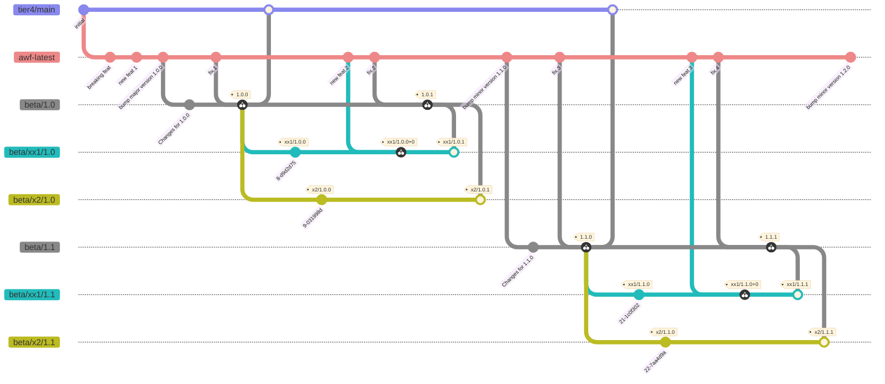

# Version/Branch Workflow for autoware.universe

本文書では、autoware.universe におけるバージョニング戦略およびブランチ運用戦略について述べる。

[English version](./universe_en.md)

## autoware.universe のバージョン定義

この文書における次の各キーワード「しなければならない（MUST）」、 「してはならない（MUST NOT）」、「要求されている（REQUIRED）」、 「することになる（SHALL）」、「することはない（SHALL NOT）」、 「する必要がある（SHOULD）」、「しないほうがよい（SHOULD NOT）」、 「推奨される（RECOMMENDED）」、「してもよい（MAY）」、 「選択できる（OPTIONAL）」は、 [RFC 2119](https://datatracker.ietf.org/doc/html/rfc2119) で述べられているように解釈する。

1. autoware.universe のバージョンは `major`.`minor`.`patch` を含んで表現しなければならない (MUST)。
2. 必要に応じて、さらに prefix を追加したバージョンを用意してもよい (MAY)。prefix とは、`major`.`minor`.`patch` 以前の文字列のことである。

### 例

- autoware.universe `1.0.0` をベースに X2 向けの変更を加えたバージョンを作成したい場合、`x2/1.0.0` をリリースする。
- `x2/1.0.0` をベースに、プロジェクトに応じてパラメータ調整などを行う場合、次のように prefix を付けてリリースすることができる。
  - `x2/shiojiri/1.0.0`
  - `x2/komatsu/1.0.0`

## autoware.universe のブランチとその役割

- `awf-latest`
  - autowarefoundation/autoware.universe:main と同期するブランチ。
  - 常に最新の変更内容を取り込んだ状態で開発を行うためのブランチ。
- `tier4/main`
  - tier4/autoware.universe における最新マイナーリリースの状態を保持するブランチ。
  - 安定して動作する最新の状態を利用するためのブランチ。
  - 基本的に、パッチリリースでは `tier4/main` は更新しない。
    - 古いバージョンに対するパッチリリースを行い、`tier4/main` に同期しようとすると、履歴がおかしくなってしまうため。
    - 最新マイナーリリースに対して重篤な不具合が発生した場合、パッチリリースに対して `tier4/main` を更新する場合がある。
- `beta/x.y`
  - `x.y.z` のバージョンリリースに用いるブランチ。
  - Code Freeze の時点で、 `awf-latest` からブランチを作成する。
  - このブランチにリリースのために必要な変更を加え、評価を実施する。
  - 評価完了後、`x.y.z` のタグを設定する。ただし、`z` の部分は 0 から順番にインクリメントする。
  - このブランチには、すべてのプロダクトにおいて共通で受け入れ可能な変更を加えることができる。
- `beta/product_name/x.y`
  - `product_name/x.y.z` のバージョンリリースに用いるブランチ。
  - Code Freeze の時点で、`x.y.z` からブランチを作成する。
  - このブランチにプロダクトリリースのために必要な変更を加え、評価を実施する。
  - 評価完了後、`product_name/x.y.z` のタグを設定する。ただし、`z` の部分はブランチ作成元の数値から順番にインクリメントする。
  - このブランチには、`product_name` に特有の変更を加えることができる。
  - もし、パッチリリースをせずに `beta/product_name/x.y.z` 上でタグを設定したい場合は、`product_name/x.y.z+a` というタグを作成してもよい。ただし、`a` の部分は 0 から順番にインクリメントする。

ブランチ運用の概略図を以下に示す。

