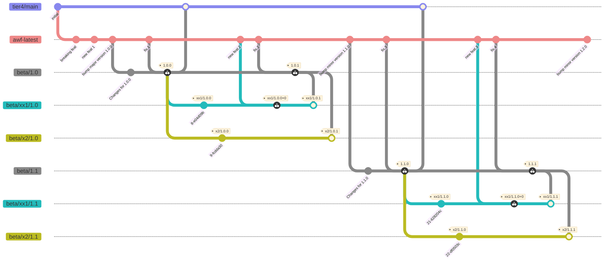

# Version/Branch Workflow for autoware.universe

In this article, we describe about the versioning / branching strategy for autoware.universe.

[Japanese version](./universe.md)

## autoware.universe Version Definition

The key words “MUST”, “MUST NOT”, “REQUIRED”, “SHALL”, “SHALL NOT”, “SHOULD”, “SHOULD NOT”, “RECOMMENDED”, “MAY”, and “OPTIONAL” in this document are to be interpreted as described in [RFC 2119](https://datatracker.ietf.org/doc/html/rfc2119).

1. A version of autoware.universe MUST take the form `major`.`minor`.`patch`.
2. You MAY create a version with prefix. prefix means that the string which is put before `major`.`minor`.`patch`.

### Examples

- If you would like to create a version with changes for X2 product to autoware.universe `1.0.0`, you may create `x2/1.0.0`.
- Based on `x2/1.0.0`, if you would like to include changes for specific projects, you may create a version with additional prefix like following:
  - `x2/shiojiri/1.0.0`
  - `x2/komatsu/1.0.0`

## autoware.universe Branches and Roles

- `awf-latest`
  - A branch to sync with autowarefoundation/autoware.universe:main.
  - To develop with the latest environment, this branch follows the upstream
- `tier4/main`
  - A branch to sync the latest released version of tier4/autoware.universe
  - Branch to use the stable version.
  - Basically, `tier4/main` should not be updated for patch release.
    - Patch release for older versions and trying to sync them to `tier4/main`, because the history is not linear.
    - For exception, if a serious bug occurs for the latest minor release, `tier4/main` may be updated for the patch release.
- `beta/x.y`
  - A branch to release `x.y.z`.
  - This branch will be created from `awf-latest` at code freeze.
  - After adding some changes necessary for release, an evaluation will be started.
  - After performing the evaluation, we create a tag `x.y.z`, where `z` will be incremented from 0.
  - You can include changes that are common and acceptable to all products in `beta/x.y`
- `beta/product_name/x.y`.
  - A branch to release `product_name/x.y.z`.
  - This branch will be created from `x.y.z` at code freeze.
  - After adding some changes necessary for product release, an evaluation will be started.
  - After performing the evaluation, we create a tag `x.y.z`, where `z` will be incremented in order from the number from which the branch was created.
  - You can include `product_name` specific changes.
  - If you would like to create tag on `beta/product_name/x.y.z` without patch release, you can create `product_name/x.y.z+a`, where `z` will be incremented from 0.

> [!WARNING]
> Creating `beta/product_name/x.y` is NOT RECOMMENDED. It makes some differences from `beta/x.y` and costs to sync upstream. In addition, it has a large risk of conflict occurring. Please use `beta/x.y` as much as possible.
> If absolutely necessary, please ask AD Release Engineering Group (@org-biz-rdd-adre).

A schematic diagram of the branching strategy is shown in following:

